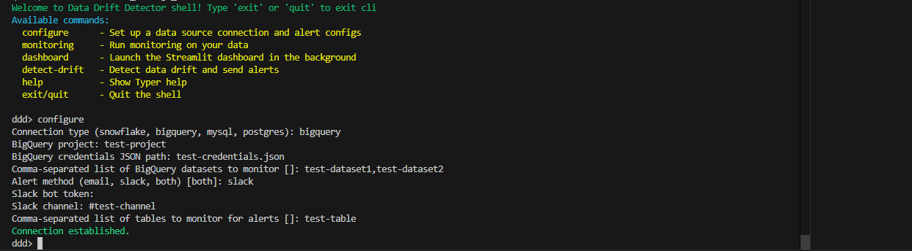

# 📊🚦 Driftmon: Data Drift Detection & Monitoring Tool

 


> Driftmon is a practical, extensible tool for profiling tables, detecting drift, and visualizing change over time across database and warehouse environments.

---

## Overview

Driftmon monitors table snapshots over time, compares current data to historical baselines, and surfaces drift using statistical tests, hash comparisons, and interactive dashboard views. It supports multiple table types and column categories, with alerts and visualization for operational use.

---

## Core Capabilities

- Baseline profiling for tables and columns
- Historical monitoring and comparison of snapshots
- Drift detection using statistical tests and distribution measures
- Support for multiple database platforms and schemas/datasets
- Streamlit dashboard for drift exploration and timeline review
- Email and Slack alerting
- CLI-driven workflows for setup, monitoring, and inspection

---

## How Driftmon Works

1. A table snapshot is profiled and stored in `monitoring_history.jsonl`.
2. Each new run adds a new record with hashes and per-column metrics.
3. Drift detection compares the latest snapshot against the previous one.
4. If hashes differ, statistical tests are applied per column type.
5. The dashboard visualizes trends, comparisons, and severity levels.

---

## Supported Column Categories and Classification

Driftmon classifies columns using the `detected_type` field in the stored metrics.

### 1) Numerical
Used for continuous or discrete numeric columns.

Typical metrics:
- `bin_edges`
- `expected_percents`

### 2) Categorical
Used for low-cardinality categorical columns.

Typical metrics:
- `full_counts`
- top category frequencies
- category proportions

### 3) Categorical High Cardinality
Used for categorical-like columns with many distinct values.

Handled similarly to categorical columns, but often with PSI-style comparison.

### 4) Unstructured Text
Used for text-heavy fields where exact category frequencies are less useful.

Typical metrics:
- `avg_character_length`
- `std_character_length`
- `unique_values`
- `uniqueness_ratio`

### 5) Date
Used for date or timestamp-like columns.

Typical metrics:
- `min`
- `max`
- `count`
- `null_counts`

### 6) Boolean
Used for true/false-like fields.

Typical metrics:
- `count`
- `nulls`
- `value_counts`

### 7) Unknown / Unsupported
Columns that do not match a supported `detected_type` are surfaced as unknown.

---

## Statistical Tests and Drift Logic

### Numerical Columns
**Metric used:** Population Stability Index (PSI)

- PSI compares bucketed distributions between snapshots.
- Lower values indicate stable distributions.
- Typical interpretation:
  - `< 0.10` stable
  - `0.10–0.25` moderate drift
  - `>= 0.25` significant drift

**Dashboard use:**
- PSI trend over time
- Previous vs latest distribution comparison

### Categorical Columns
**Metric used:** Jensen-Shannon Divergence (JSD) in the dashboard, and Pearson Chi-Square in detection logic

- The dashboard computes JSD from category probability distributions.
- Detection logic uses:
  - **Pearson Chi-Square test** for standard categorical columns
  - **PSI** for categorical high-cardinality columns

### Unstructured Text Columns
**Tests used:** Z-test for average text length, plus uniqueness-ratio comparison

- Average character length is compared using a z-score-based test.
- Uniqueness ratio is compared using an absolute threshold.
- Drift is flagged when either signal changes meaningfully.

### Boolean Columns
**Test used:** Two-sample proportions z-test

- Compares the proportion of `True`/`False` values across snapshots.
- Useful for detecting changes in binary distributions.

### Date Columns
**Logic used:** Range shift / data completeness checks

- Compares latest min/max date values against the previous snapshot.
- Flags:
  - backfilled or stale data
  - large gaps
  - insufficient data / zero-epoch values
- Also tracks completeness through null counts.

### Hash-Based Change Detection
Before statistical comparison, Driftmon checks whether the latest table hash differs from the previous one.

- If hashes match, drift is unlikely.
- If hashes differ, statistical drift analysis is performed.
- The dashboard and detector use hash history to reduce unnecessary computation.

---

## Dashboard Views

The Streamlit dashboard provides:

- PSI trends for numerical columns
- JSD trends for categorical columns
- Text-length and uniqueness trend views
- Date range evolution and completeness metrics
- Boolean proportion charts
- Timeline of monitoring runs
- Raw metric inspection for each selected column

---

## Hash Retrieval Strategy and `mmap` Trade-offs

Driftmon uses `mmap` when reading the latest hashes from the history file.

### Why `mmap` was used
- Faster reverse-style scanning from the end of large files
- Lower overhead than loading the full file into Python objects
- Efficient for newline-delimited JSON history logs
- Useful when only the most recent entries are needed

### Trade-offs
- Best suited for local, seekable files
- Adds implementation complexity compared to normal line iteration
- Less portable for non-file-like sources such as streams
- Mapping very large files still depends on OS virtual memory behavior
- Reverse scanning logic is more specialized than a simple forward parser

### Practical impact
This approach is efficient for monitoring history files that grow over time, where the most recent hashes are usually the only values needed for drift comparison.

---

## Architecture
```
+----------------------+
|   driftmon package   |
|pip install driftmon  |
+----------+-----------+
           |
           v
+----------------------+
|     Connectors       |
| BigQuery / Snowflake |
| MySQL / PostgreSQL   |
+----------+-----------+
           |
           v
+----------------------+
| Baseline Profiling   |
| save_profile()       |
| stats / hashes       |
+----------+-----------+
           |
           v
+----------------------+
|   monitoring.json    |
| stored baseline data |
+----------+-----------+
           |
           v
+----------------------+
|  Drift Detection     |
| detect_drift()       |
| compare baselines    |
+-----+---------+------+
      |         |
      |         v
      |   +-------------+
      |   | Alerts      |
      |   | Email/Slack  |
      |   +-------------+
      |
      v
+----------------------+
|     Dashboard        |
| Streamlit            |
| change history       |
+----------------------+
```
---

## Installation

```bash
pip install driftmon
```

Or from source:

```bash
git clone https://github.com/Human-Gechi/data_drift_detector.git
cd data_drift_detector
pip install -e .
```

---

## CLI Commands

| Command      | Description                                      |
|--------------|--------------------------------------------------|
| configure    | Set up source connection and alerting settings   |
| monitoring   | Profile and store baseline statistics            |
| detect-drift | Run drift detection and generate reports         |
| dashboard    | Launch the Streamlit dashboard                   |
| help         | Show CLI help                                    |
| exit/quit    | Exit the CLI                                     |

---

## Quick Start

### CLI Preview


### 1. Configure
```bash
driftmon configure
```

### 2. Profile and Monitor
```bash
driftmon monitoring
```

### 3. Detect Drift
```bash
driftmon detect-drift
```

### 4. Launch Dashboard
```bash
driftmon dashboard
```

---

## Supported Data Sources

- Google BigQuery
- Snowflake
- MySQL
- PostgreSQL

---

## Example Usage

### Using Context Managers

```python
from driftmon.connector.bigquery_connector import BigQueryConn
from driftmon.detect.monitoring import save_profile
from driftmon.detect.drift_detector import detect_drift
from driftmon.alerts.email_alert import Email

def export_data(conn, dataset, tables):
    result = conn.get_group_data(datasets=dataset, table_names=tables)
    for key, df in result:
        df.to_csv(f"{key}.csv", index=False)

def profile_and_detect(conn, dataset, tables):
    save_profile(conn_type="bigquery", connector=conn, datasets=dataset, table_names=tables)
    return detect_drift(table_names=tables)

def send_drift_email(drift_report, sender, password, receiver):
    email = Email(
        sender=sender,
        password=password,
        receiver=receiver,
        drift_report=drift_report
    )
    email.send_email()

tables = "test_table2"
dataset = "1306_data"

with BigQueryConn(
    project="meta-spirit-494622-f5",
    credentials_path="meta-spirit-494622-f5-82b375b04e9e.json"
) as conn:
    export_data(conn, dataset, tables)
    drift_report = profile_and_detect(conn, dataset, tables)
    send_drift_email(
        drift_report,
        sender="sender@gmail.com",
        password="your-password",
        receiver="receiver@gmail.com"
    )
```

### Without Context Managers

```python
from driftmon.connector.bigquery_connector import BigQueryConn
from driftmon.detect.monitoring import save_profile
from driftmon.detect.drift_detector import detect_drift
from driftmon.alerts.email_alert import Email

tables = "test_table2"
dataset = "1306_data"
conn = BigQueryConn(
    project="meta-spirit-494622-f5",
    credentials_path="meta-spirit-494622-f5-82b375b04e9e.json"
)
conn.connect()
try:
    result = conn.get_group_data(datasets=dataset, table_names=tables)
    for key, df in result:
        print(key)
        print(df)
except Exception as e:
    print("Error:", e)

save_profile(conn_type="bigquery", connector=conn, datasets=dataset, table_names=tables)
drift_report = detect_drift(table_names=tables)
email = Email(
    sender="sender@gmail.com",
    password="your-password",
    receiver="receiver@gmail.com",
    drift_report=drift_report
)
email.send_email()
```

---

## Contributing

Contributions are welcome.

Guidelines:
- follow existing code style
- add tests for behavior changes
- update docs when behavior changes
- keep changes focused and reviewable

---

## Author

**Ogechukwu Okoli**

GitHub: [Human-Gechi](https://github.com/Human-Gechi)
Email: okoliogechi74@gmail.com

---
## Thank you for using Driftmon
Stay ahead of data drift and keep pipelines reliable.
